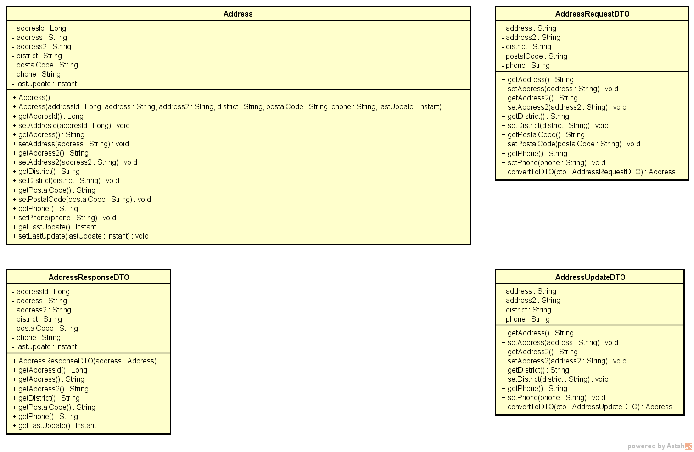
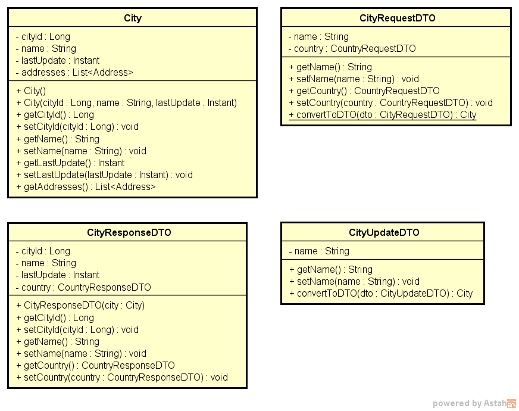
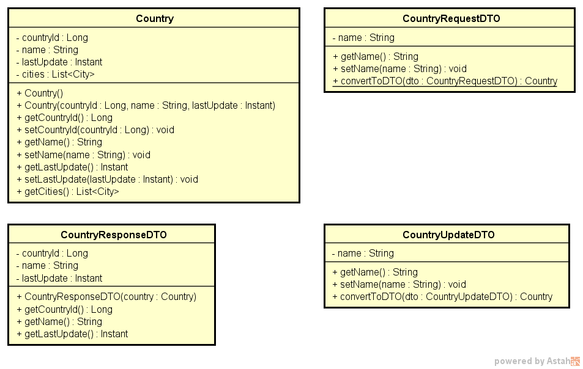
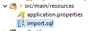

# Data Transfer Object

Uma classe DTO (Data Transfer Object) em Java é frequentemente usada em APIs para encapsular dados que são transmitidos entre o cliente e o servidor. Ela serve como um objeto intermediário que ajuda a estruturar e organizar os dados transferidos, tornando a comunicação mais eficiente e menos propensa a erros. No contexto de uma API HTTP, uma classe DTO pode desempenhar várias funções importantes:

1. **Filtrar dados indesejados**: Uma classe DTO pode ser usada para selecionar apenas os campos relevantes da requisição HTTP que devem ser processados pelo servidor. Isso ajuda a reduzir a sobrecarga de processamento no servidor, evitando que ele processe informações desnecessárias.
2. **Controlar a exposição de dados**: Em muitos casos, você não deseja expor todos os detalhes internos de seus objetos de domínio diretamente na API. Uma classe DTO permite que você exponha apenas os campos que são apropriados para a comunicação externa, mantendo a encapsulamento e a segurança dos dados internos.
3. **Versionamento**: À medida que sua API evolui ao longo do tempo, você pode precisar adicionar, remover ou modificar campos nos objetos de domínio. Usar classes DTO permite que você gerencie a versão da API de forma mais eficaz, introduzindo novas versões de DTOs sem afetar a estrutura interna dos objetos de domínio.
4. **Reduzir acoplamento**: Usar uma classe DTO ajuda a reduzir o acoplamento entre o cliente e o servidor. O cliente não precisa saber como os objetos de domínio são estruturados internamente, apenas precisa conhecer a estrutura dos DTOs. Isso facilita a manutenção e a evolução da API.
5. **Validação**: Uma classe DTO também pode ser usada para validar os dados da requisição antes de processá-los. Isso ajuda a garantir que os dados recebidos sejam consistentes e válidos antes de serem utilizados pelo servidor.

Este projeto é uma implementação simples de uma API REST com o intuito de entender melhor o funcionamento de classes DTO. Essa API oferece funcionalidades de consulta e manipulação de dados baseado em classe fictícias denominadas `address`, `city` e `country`.

### Tabela Address

| Propriedade | Tipo de dado |
| :---------- | :----------- |
| addressId   | Long         |
| address     | String       |
| address2    | String       |
| district    | String       |
| postalCode  | String       |
| phone       | String       |
| lastUpdate  | Instant      |
| cityId      | City         |

### Tabela City

| Propriedade | Tipo de dado |
| :---------- | :----------- |
| cityId      | Long         |
| name        | String       |
| lastUpdate  | Instant      |
| countryId   | Country      |

### Tabela Country

| Propriedade | Tipo de dado |
| :---------- | :----------- |
| countryId   | Long         |
| name        | String       |
| lastUpdate  | Instant      |

## Planejamento das classes

Entity - representa a entidade e reflete uma tabela no banco de dados.
RequestDTO - representa os dados permitidos a serem enviados na requisição.
ResponseDTO - representa os dados a serem retornados da requisição.
UpdateDTO - representa somente os dados que podem ser atualizados pelo usuário.

| Address    | AddressRequestDTO | AddressResponseDTO | AddressUpdateDTO |
| :--------- | :---------------- | :----------------- | :--------------- |
| addressId  |                   | addressId          |                  |
| address    | address           | address            | address          |
| address2   | address2          | address2           | address2         |
| district   | district          | district           | district         |
| postalCode | postalCode        | postalCode         |                  |
| phone      | phone             | phone              | phone            |
| lastUpdate |                   | lastUpdate         |                  |
| cityId     |                   | cityId             |                  |

## Diagrama de classes

### Address

### City

### Country

## Endpoints

### Country

| Método HTTP | Prefixo | Endpoint     | Descrição                                            |
| ----------- | ------- | ------------ | ---------------------------------------------------- |
| POST        | /api/v1 | /countries   | Cria um novo país.                                   |
| GET         | /api/v1 | /countries/1 | Retorna o país com o id 1.                           |
| GET         | /api/v1 | /countries   | Recupera uma lista paginada de todos os países.      |
| PUT         | /api/v1 | /countries/1 | Atualiza o país com o id 1.                          |
| DELETE      | /api/v1 | /countries/1 | Remove o país com o id 1 (inclusive cidades filhas). |

### City

| Método HTTP | Prefixo | Endpoint  | Descrição                                        |
| ----------- | ------- | --------- | ------------------------------------------------ |
| POST        | /api/v1 | /cities   | Cria uma nova cidade com país.                   |
| GET         | /api/v1 | /cities/1 | Retorna a cidade com o id 1.                     |
| GET         | /api/v1 | /cities   | Recupera uma lista paginada de todos as cidades. |
| PUT         | /api/v1 | /cities/1 | Atualiza a cidade com o id 1.                    |
| DELETE      | /api/v1 | /cities/1 | Remove a cidade com o id 1.                      |

### Address

| Método HTTP | Prefixo | Endpoint     | Descrição                                          |
| ----------- | ------- | ------------ | -------------------------------------------------- |
| POST        | /api/v1 | /addresses   | Cria um novo endereço.                             |
| GET         | /api/v1 | /addresses/1 | Retorna o endereço com o id 1.                     |
| GET         | /api/v1 | /addresses   | Recupera uma lista paginada de todos os endereços. |
| PUT         | /api/v1 | /addresses/1 | Atualiza o endereço de id 1.                       |
| DELETE      | /api/v1 | /addresses/1 | Remove o endereço com o id 1.                      |

## Requisições Json
[Link](docs/requisicoes-json.md)

## SQL para simulação

Opcionalmente pode-se inserir os dados nas tabelas via script sql, criando um arquivo na pasta resources:

[Link](docs/script.sql)